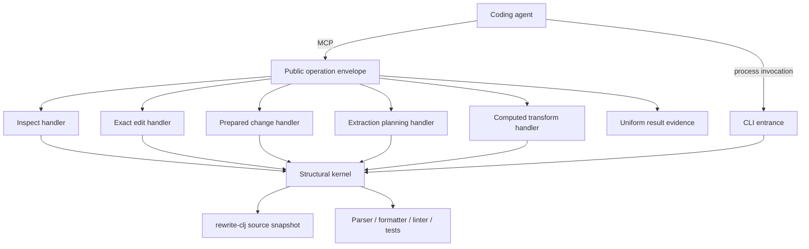

# High-Level Design: clj-surgeon

## Problem

Coding agents can usually decide what a Clojure program should become, but they
pay substantial time and risk reconstructing syntax ownership, exact source
boundaries, stale-source guards, and multi-file write mechanics. General text
editors expose bytes; semantic language servers expose meaning; neither alone
provides a small, lossless, failure-atomic structural instrument suitable for
an agent.

The public MCP boundary compounds this problem when nominally similar tools
report different evidence. A caller should not need tool-specific knowledge to
determine whether an operation succeeded, refused safely, completed
verification, or consumed meaningful server time.

## Approach

clj-surgeon is a small structural kernel for Clojure agents. The model and
human retain architectural judgment. The kernel supplies exact structural
perception, guarded mutation, failure-atomic transactions, and terminal
evidence against a frozen source snapshot.

The CLI and persistent MCP service expose the same underlying structural
authority through entrances suited to different latency and integration needs.
The MCP service uses a uniform public operation envelope around specialized
handlers. The envelope owns cross-cutting result evidence; handlers own the
domain result and its concise summary.

## Target Users

- Coding agents that know the intended Clojure change and need to execute it
  with fewer interaction boundaries and less source reconstruction.
- Humans supervising agent changes who need concise evidence that a structural
  operation was exact, guarded, and complete.
- Tool builders evaluating whether a structural operation produces a real
  correctness or wall-clock advantage over native search and patching.

## Goals

- Make exact structural reads and writes cheap enough to improve complete,
  verified task time.
- Preserve source spelling, comments, ownership, and snapshot guards without
  transferring design judgment into the tool.
- Commit one coherent multi-owner decision as one reversible transaction.
- Apply one exact root-scoped data change across an explicit set of Clojure or
  EDN files without repeating the same guarded intent per file.
- Give every public MCP result enough uniform evidence for a caller to
  understand outcome, elapsed server work, and next action.
- Let a caller state one bounded read mission, resolve only exact mechanical
  clues against one frozen snapshot, and continue an incomplete batch without
  repeating successful reads.
- Refuse stale, ambiguous, malformed, over-budget, or unverifiable work before
  unsafe mutation, or roll back the complete transaction.

## Non-Goals

- Replacing `rg`, native patching, compilers, linters, tests, or nREPL when
  those are the cheaper authority.
- Inferring architecture, desired semantics, or a widening edit scope.
- Claiming server execution time is end-to-end model or transport latency.
- Treating edit distance, prefix similarity, source proximity, or a sole
  remaining candidate as authority to select an owner.
- Reporting incomplete read evidence as a complete batch or granting write
  authority from a refused read.
- Turning every cross-cutting field into a new framework or middleware layer.
- Retaining a second logic model that finds no counterexample beyond native
  tests.

## Tenets

- **Complete verified task time over tool adoption.** Structural machinery must
  earn its interaction, correctness, or safety cost against native tools.
- **Uniform public contracts over handler autonomy.** Shared result evidence
  should not vary because operations have different internal implementations.
- **Server-owned time over simulated end-to-end time.** Report the interval the
  service can measure honestly and leave caller and transport latency to their
  owners.
- **Refusals are first-class results.** A safe refusal needs the same
  observability discipline as a successful mutation.
- **Bookkeeping over judgment.** The kernel performs exact mechanics while the
  model and human decide meaning.

## System Design

The public operation envelope measures server-owned execution and finalizes a
common result contract. It does not interpret domain outcomes. Each handler
returns its specialized data and supplies its concise human summary. The
envelope adds common evidence and ensures success and refusal paths obey the
same public law.

Long-running verification has two clocks: request time describes the bounded
request that launched or inspected the job; job time describes asynchronous
work completed elsewhere. Neither value substitutes for the other.

The first leaf design is the MCP operation contract under
`docs/intent/mcp-operation-contract/`. Other subsystems remain outside the
initial Linked-Intent Development scope and continue to follow the repository's
existing plans and testing guidance.

The compact exact editor treats `.edn` as lossless Clojure data, not as a
namespace. An EDN edit must use root scope, may apply one exact replacement to
an explicit file set, and compiles into the existing frozen multi-file
transaction. Namespace ownership, named-form ownership, owner deletion, and
semantic indexing remain source-file capabilities.

A Clojure namespace location may be named explicitly or written as
`within.namespace=true`. The latter resolves the file's unique `ns` owner so a
caller need not restate information already present in the target file.

Extraction planning is a read operation over the same pure compiler and
workspace snapshot used by extraction execution. It returns a bounded movement
manifest, complete structural caller evidence, a frozen source identity, and a
ready-to-fill next call. The model chooses architecture and caller semantics;
the kernel owns exact form closure, counts, source guards, and failure-atomic
execution. Planning grants no write authority, and a stale plan refuses before
mutation.

An exact repository verifier may participate in the same guarded mutation only
when the workspace declares it as closed data. The request names the
conventional exact profile; it never supplies a command. The executor validates
that project-owned profile before mutation, writes and reads back the candidate
bytes through the existing transaction, and then runs the declared argument
vector from the project root. Exact-exit profiles do not inherit clj-kondo's
diagnostic-baseline mode: the kernel does not add arguments, compare a finding
delta, strengthen warning policy, or substitute a built-in profile. Exit zero
returns terminal verified evidence. Nonzero exit, timeout, launch failure, or
process crash rolls the complete transaction back. An unavailable verifier is
unverified, never evidence that the change failed safely enough to retry
blindly.

Every Surgeon-owned clj-kondo process also crosses one host-wide admission
gate. The gate is shared across repositories and JVMs, admits at most one
analyzer, and spends lock waiting from the command's existing deadline. The
gate wrapper makes its lock descriptor inheritable and then replaces itself
with the resolved analyzer, so the analyzer owns authority for its complete
lifetime even if the caller JVM dies. It records the admitted owner PID and
canonical command CWD, but the operating-system lock—not stale owner text—is
authority. Admission loss launches no analyzer; an MCP verifier treats it as
unavailable verification authority and retains the existing rollback contract.
Other commands do not pay this gate. An installed direct-shell entrance shares
the lock, while an absolute call to an unrelated clj-kondo binary remains an
explicit advisory-lock bypass.

Admission is also pressure-aware. The gate reads the current one-minute load
without a subprocess and may consume one fresh bounded flight-recorder sample.
A fresh red or critical sample, or current normalized load at the red threshold,
returns typed unavailable analyzer authority before waiting, while waiting, or
after lock acquisition; no analyzer child starts. Yellow pressure still permits
the one admitted analyzer. Admission records bounded request, CWD, scope,
pressure, wait, and owner evidence in an append-only machine-local event stream.
It does not claim that the analyzer caused observed pressure.

An operation that uses analyzer evidence to plan a mutation must finish that
analysis before its first write. Execution re-resolves exact owners against the
frozen plan and current source snapshot; it does not reacquire analyzer
authority after partial mutation. This keeps an admission refusal from
stranding half-applied source.

The analyzer test pyramid separates policy coverage from provider drift. Pure
tests replay provenance-bearing normalized analysis fixtures; fake processes
prove admission, deadline, cleanup, and rollback boundaries; a small mandatory
sequential contract target runs the real analyzer for schema and adapter
integrity. Full local suites shall not pay one real analyzer process for every
combinatorial policy case.

The mandatory analyzer contract uses one internal test-mission lease over the
same physical admission gate. The lease binds the repository-owned runner,
canonical CWD, scope hash, five-launch budget, and five-minute expiry. It does
not reserve the analyzer across children. Each child releases admission when it
exits, and the next child must obtain a new pressure observation taken after
that exit. Interactive analyzer requests use the same physical lock and have
priority between mission children. A lease cannot override pressure, extend
its budget, or be minted by an MCP request or analyzer command.

A successful exact-verifier mutation may also publish one deterministic
terminal response. This response is an apply-owned presentation of normalized
commit, read-back, receipt, and exact-exit evidence; it is never verification
authority and never model-authored. The response is absent for non-exact
success, pending verification, refusal, rollback, failure, and every unverified
state. The shared MCP operation finalizer remains unchanged and continues to
own only elapsed time. A coding agent may relay the terminal response verbatim
only when that mutation completes all remaining user-requested work; otherwise
the agent treats it as terminal evidence for that operation and continues.

### Compress a coherent read mission without guessing

The read path treats a coherent set of known questions as one immutable
mission. The caller supplies exact selectors and, when needed, explicit
mechanical fallback clues such as a literal contained by one owner, a
containing line, a fully qualified owner, or a declared alias. The kernel
captures each file once, resolves those clues against the complete frozen
candidate universe, and returns bounded evidence with source hashes and exact
owner anchors.

Five independently testable modules compose the read-mission surface:

1. A complete selector diagnostic names the failed request, file, requested
   owner, failure kind, candidate counts, bounded hints, and truncation state in
   both the concise and structured result.
2. A snapshot continuation retains successful sibling reads after a
   selector-local failure. It does not publish ordinary complete `results`.
3. A bounded resolve-and-read entrance accepts only declared exact clue types.
   Zero or multiple owners refuse. Similarity ranking remains hint-only.
4. A retry compiler emits one schema-valid, snapshot-bound next call only when
   a declared exact relation proves one correction.
5. A declarative read-mission graph schedules caller-supplied questions,
   reuses snapshot-bound selections, enforces an evidence budget, and returns
   guard-ready anchors for a later explicit write decision.

Schema, path, parse, snapshot, and output-budget failures remain fail-empty.
Only selector-local failures can create a continuation. A continuation remains
`ok=false` and `read_complete=false` until every ordered request resolves.
Partial evidence is not write authority. Complete reads can return stale-source
guards, but they do not invent replacement text or claim semantic correctness.

This design applies the same compiler boundary to perception that transactions
already apply to mutation. The model chooses the questions and meaning. The
kernel owns ordering, snapshot reuse, exact resolution, bounded presentation,
and executable recovery.

The interface must improve as model capability improves. Surgeon exposes the
complete bounded owner universe, source anchors, typed relation traces, and
cheap snapshot-bound probes. The model can turn an unsupported owner claim into
a hypothesis such as "I think you may have meant this owner." The kernel keeps
that hypothesis separate from authority until an exact relation proves it.
The transport-neutral exact-form selector compiles the same source-free owner
vocabulary and non-authoritative hypotheses for CLI and MCP callers. Each
entrance keeps its own envelope, timing, and rendering contract.
This separation favors general model reasoning over an expanding catalog of
tool-owned typo, spelling, or naming heuristics.

## Key Design Decisions

### Finalize results through one explicit operation envelope

The MCP boundary uses a shared finalizer rather than independent handler
instrumentation. This keeps timing and common evidence mechanically uniform
while leaving operation-specific summaries close to their owners.

Server-registration middleware was rejected because it would hide important
differences between synchronous results and asynchronous verification.
Independent instrumentation was rejected because a future tool could silently
omit the contract.

### Keep elapsed time additive and observational

Elapsed measurement may enrich structured results and summaries but must not
change selection, mutation, rollback, verification, or refusal semantics. It
measures owned server work and excludes model reasoning, client scheduling,
network transport, and background job duration.

### Keep resolution relations explicit

An executable read correction requires proof from one declared mechanical
relation over the complete frozen candidate universe. Supported relation
families can include exact transport normalization, exact fully qualified
ownership, a namespace alias declared in the snapshot, and an explicitly
supplied literal or line contained by exactly one top-level owner. Each
relation reports its trace.

Edit distance, common prefixes, pluralization, case folding, inferred
abbreviations, lexical order, and source proximity can rank bounded hints. They
cannot select an owner, emit an executable retry, or satisfy a read request.
This keeps helpful discovery separate from authority.

### Gate durable intent in the ordinary suite

Every active MCP operation-contract intent must have implementation and test
witnesses. The coherence check and any retained logic oracle run from the
ordinary `make runtests` path. A check that agents must remember to invoke is
not a gate.

A Prolog shadow oracle is provisional. It is retained only if its independent
relation across operation, outcome, and verification state reveals a
counterexample that the native contract tests missed.

## Success Metrics

- Every public MCP operation returns a finite, non-negative `elapsed_ms` on
  success and refusal and renders the same value in its human summary.
- A newly registered public MCP operation cannot pass the ordinary test suite
  without satisfying the shared envelope contract.
- Asynchronous verification reports request and job elapsed times without
  conflating them.
- Timing instrumentation causes no source mutation, verification, or rollback
  behavior change.
- Representative structural tasks remain correctness-gated and are compared
  against native routes by complete wall time, not server timing alone.
- Selector-local refusals expose the exact missing owner and preserve completed
  sibling work through a snapshot-bound continuation without exposing partial
  evidence as complete results.
- Every executable retry is schema-valid, applies only to its retained
  snapshot, and succeeds on that snapshot. Ambiguous cases never emit one.
- The two motivating wrong-owner missions complete without `sed` fallback, and
  clean-context replay reports calls, complete wall, direct tool wall, returned
  characters, correction turns, and false automatic selections.
- A 10x complete-wall claim requires 100% correct owner selection, zero guessed
  selections, and a per-caller median at or below 10% of the frozen current
  control. Mechanically ambiguous missions have a separate gate and are not
  pooled into that claim.

Any of these conditions falsifies the design:

- Callers need operation-specific recovery to discover basic outcome evidence.
- A refusal omits timing.
- An automatic resolution uses a heuristic instead of a declared exact
  relation.
- A caller mistakes partial evidence for a complete read.
- The server reports background job time as request latency.
- A new public tool bypasses the contract gate.

## References

- [Vision](vision.md)
- [Clojure agent tool stack](architecture-stack.md)
- [Testing guidelines](testing-guidelines.md)
- [Uniform MCP elapsed-time plan](plans/uniform-mcp-elapsed-time.md)
