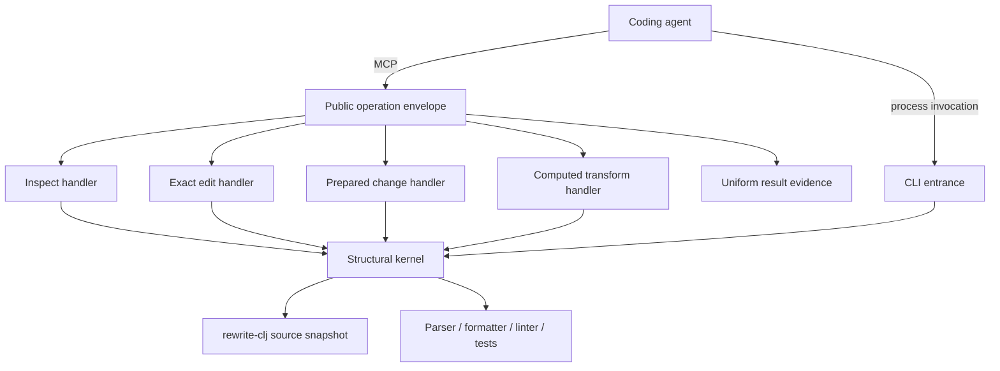

# High-Level Design: clj-surgeon

## Problem

Coding agents can usually decide what a Clojure program should become, but they
pay substantial time and risk reconstructing syntax ownership, exact source
boundaries, stale-source guards, and multi-file write mechanics. General text
editors expose bytes; semantic language servers expose meaning; neither alone
provides a small, lossless, failure-atomic structural instrument suitable for
an agent.

The public MCP boundary compounds this problem when nominally similar tools
report different evidence. A caller should not need tool-specific knowledge to
determine whether an operation succeeded, refused safely, completed
verification, or consumed meaningful server time.

## Approach

clj-surgeon is a small structural kernel for Clojure agents. The model and
human retain architectural judgment. The kernel supplies exact structural
perception, guarded mutation, failure-atomic transactions, and terminal
evidence against a frozen source snapshot.

The CLI and persistent MCP service expose the same underlying structural
authority through entrances suited to different latency and integration needs.
The MCP service uses a uniform public operation envelope around specialized
handlers. The envelope owns cross-cutting result evidence; handlers own the
domain result and its concise summary.

## Target Users

- Coding agents that know the intended Clojure change and need to execute it
  with fewer interaction boundaries and less source reconstruction.
- Humans supervising agent changes who need concise evidence that a structural
  operation was exact, guarded, and complete.
- Tool builders evaluating whether a structural operation produces a real
  correctness or wall-clock advantage over native search and patching.

## Goals

- Make exact structural reads and writes cheap enough to improve complete,
  verified task time.
- Preserve source spelling, comments, ownership, and snapshot guards without
  transferring design judgment into the tool.
- Commit one coherent multi-owner decision as one reversible transaction.
- Apply one exact root-scoped data change across an explicit set of Clojure or
  EDN files without repeating the same guarded intent per file.
- Give every public MCP result enough uniform evidence for a caller to
  understand outcome, elapsed server work, and next action.
- Refuse stale, ambiguous, malformed, over-budget, or unverifiable work before
  unsafe mutation, or roll back the complete transaction.

## Non-Goals

- Replacing `rg`, native patching, compilers, linters, tests, or nREPL when
  those are the cheaper authority.
- Inferring architecture, desired semantics, or a widening edit scope.
- Claiming server execution time is end-to-end model or transport latency.
- Turning every cross-cutting field into a new framework or middleware layer.
- Retaining a second logic model that finds no counterexample beyond native
  tests.

## Tenets

- **Complete verified task time over tool adoption.** Structural machinery must
  earn its interaction, correctness, or safety cost against native tools.
- **Uniform public contracts over handler autonomy.** Shared result evidence
  should not vary because operations have different internal implementations.
- **Server-owned time over simulated end-to-end time.** Report the interval the
  service can measure honestly and leave caller and transport latency to their
  owners.
- **Refusals are first-class results.** A safe refusal needs the same
  observability discipline as a successful mutation.
- **Bookkeeping over judgment.** The kernel performs exact mechanics while the
  model and human decide meaning.

## System Design

The public operation envelope measures server-owned execution and finalizes a
common result contract. It does not interpret domain outcomes. Each handler
returns its specialized data and supplies its concise human summary. The
envelope adds common evidence and ensures success and refusal paths obey the
same public law.

Long-running verification has two clocks: request time describes the bounded
request that launched or inspected the job; job time describes asynchronous
work completed elsewhere. Neither value substitutes for the other.

The first leaf design is the MCP operation contract under
`docs/intent/mcp-operation-contract/`. Other subsystems remain outside the
initial Linked-Intent Development scope and continue to follow the repository's
existing plans and testing guidance.

The compact exact editor treats `.edn` as lossless Clojure data, not as a
namespace. An EDN edit must use root scope, may apply one exact replacement to
an explicit file set, and compiles into the existing frozen multi-file
transaction. Namespace ownership, named-form ownership, owner deletion, and
semantic indexing remain source-file capabilities.

A Clojure namespace location may be named explicitly or written as
`within.namespace=true`. The latter resolves the file's unique `ns` owner so a
caller need not restate information already present in the target file.

## Key Design Decisions

### Finalize results through one explicit operation envelope

The MCP boundary uses a shared finalizer rather than independent handler
instrumentation. This keeps timing and common evidence mechanically uniform
while leaving operation-specific summaries close to their owners.

Server-registration middleware was rejected because it would hide important
differences between synchronous results and asynchronous verification.
Independent instrumentation was rejected because a future tool could silently
omit the contract.

### Keep elapsed time additive and observational

Elapsed measurement may enrich structured results and summaries but must not
change selection, mutation, rollback, verification, or refusal semantics. It
measures owned server work and excludes model reasoning, client scheduling,
network transport, and background job duration.

### Gate durable intent in the ordinary suite

Every active MCP operation-contract intent must have implementation and test
witnesses. The coherence check and any retained logic oracle run from the
ordinary `make runtests` path. A check that agents must remember to invoke is
not a gate.

A Prolog shadow oracle is provisional. It is retained only if its independent
relation across operation, outcome, and verification state reveals a
counterexample that the native contract tests missed.

## Success Metrics

- Every public MCP operation returns a finite, non-negative `elapsed_ms` on
  success and refusal and renders the same value in its human summary.
- A newly registered public MCP operation cannot pass the ordinary test suite
  without satisfying the shared envelope contract.
- Asynchronous verification reports request and job elapsed times without
  conflating them.
- Timing instrumentation causes no source mutation, verification, or rollback
  behavior change.
- Representative structural tasks remain correctness-gated and are compared
  against native routes by complete wall time, not server timing alone.

The design is falsified if callers need operation-specific recovery to discover
basic outcome evidence, if a refusal omits timing, if background job time is
reported as request latency, or if the contract gate can be bypassed by adding
a new public tool.

## References

- [Vision](vision.md)
- [Clojure agent tool stack](architecture-stack.md)
- [Testing guidelines](testing-guidelines.md)
- [Uniform MCP elapsed-time plan](plans/uniform-mcp-elapsed-time.md)
