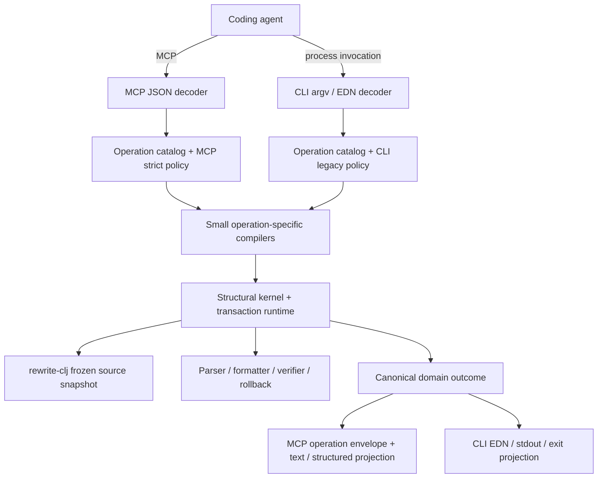
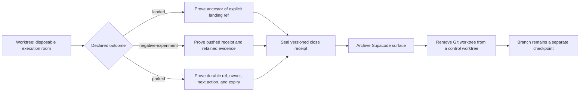
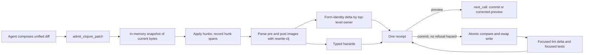

# High-Level Design: clj-surgeon

## Problem

Coding agents can usually decide what a Clojure program should become, but they
pay substantial time and risk reconstructing syntax ownership, exact source
boundaries, stale-source guards, and multi-file write mechanics. General text
editors expose bytes; semantic language servers expose meaning; neither alone
provides a small, lossless, failure-atomic structural instrument suitable for
an agent.

The public MCP boundary compounds this problem when nominally similar tools
report different evidence. A caller should not need tool-specific knowledge to
determine whether an operation succeeded, refused safely, completed
verification, or consumed meaningful server time.

## Approach

clj-surgeon is a small structural kernel for Clojure agents. The model and
human retain architectural judgment. The kernel supplies exact structural
perception, guarded mutation, failure-atomic transactions, and terminal
evidence against a frozen source snapshot.

The CLI and persistent MCP service are transport-native projections over one
operation algebra and canonical domain outcome. Each entrance decodes its own
public contract and selects a trusted policy profile. Small operation-specific
compilers own domain facts. The shared transaction runtime owns snapshots,
formatting, mutation, verification, rollback, and receipts.

The CLI does not call the MCP transport or consume MCP presentation and policy.
The MCP service does not parse CLI output or inherit CLI compatibility policy.
Both entrances consume the same compiled domain facts and project them through
their existing public contracts. The MCP service additionally uses a uniform
public operation envelope around its projections; that envelope owns
cross-cutting result evidence and concise human presentation.

## Target Users

- Coding agents that know the intended Clojure change and need to execute it
  with fewer interaction boundaries and less source reconstruction.
- Humans supervising agent changes who need concise evidence that a structural
  operation was exact, guarded, and complete.
- Tool builders evaluating whether a structural operation produces a real
  correctness or wall-clock advantage over native search and patching.

## Goals

- Make exact structural reads and writes cheap enough to improve complete,
  verified task time.
- Preserve source spelling, comments, ownership, and snapshot guards without
  transferring design judgment into the tool.
- Commit one coherent multi-owner decision as one reversible transaction.
- Compile shared operation facts and terminal outcomes once, then project them
  without duplicating domain rules in CLI and MCP adapters.
- Preserve CLI compatibility and MCP safety policy as explicit entrance-owned
  profiles rather than weakening either contract for superficial uniformity.
- Apply one exact root-scoped data change across an explicit set of Clojure or
  EDN files without repeating the same guarded intent per file.
- Give every public MCP result enough uniform evidence for a caller to
  understand outcome, elapsed server work, and next action.
- Let a caller state one bounded read mission, resolve only exact mechanical
  clues against one frozen snapshot, and continue an incomplete batch without
  repeating successful reads.
- Close terminal experiment worktrees without losing the decision, exact
  candidate identity, negative result, or raw evidence needed to reconstruct
  the experiment.
- Refuse stale, ambiguous, malformed, over-budget, or unverifiable work before
  unsafe mutation, or roll back the complete transaction.

## Non-Goals

- Replacing `rg`, native patching, compilers, linters, tests, or nREPL when
  those are the cheaper authority.
- Inferring architecture, desired semantics, or a widening edit scope.
- Claiming server execution time is end-to-end model or transport latency.
- Treating edit distance, prefix similarity, source proximity, or a sole
  remaining candidate as authority to select an owner.
- Reporting incomplete read evidence as a complete batch or granting write
  authority from a refused read.
- Turning every cross-cutting field into a new framework or middleware layer.
- Routing the CLI through HTTP, stdio MCP, JSON, MCP handlers, or a running
  service.
- Requiring equal public operation counts, request schemas, output shapes, or
  recovery workflows across CLI and MCP.
- Retaining a second logic model that finds no counterexample beyond native
  tests.
- Treating an old worktree, a local-only branch, or a Supacode tab as durable
  experimental memory.
- Automatically deleting dirty worktrees, local-only evidence, branches, tags,
  archives, or remote refs because they are old.

## Tenets

- **Complete verified task time over tool adoption.** Structural machinery must
  earn its interaction, correctness, or safety cost against native tools.
- **Uniform public contracts over handler autonomy.** Shared result evidence
  should not vary because operations have different internal implementations.
- **Server-owned time over simulated end-to-end time.** Report the interval the
  service can measure honestly and leave caller and transport latency to their
  owners.
- **Refusals are first-class results.** A safe refusal needs the same
  observability discipline as a successful mutation.
- **Bookkeeping over judgment.** The kernel performs exact mechanics while the
  model and human decide meaning.
- **Structural identity over positional authority.** A direct mutation names
  its owner. Lines, ordinals, indexes, and other positional coordinates may
  describe or inspect code, but they never select the subject of a write.
- **Common truth over common facade.** Entrances share compiled facts and
  terminal outcomes while retaining the public contracts and policies that fit
  their callers.
- **Disposable execution rooms, durable experimental memory.** A worktree is a
  place to execute work. Branches are checkpoints. Receipts, observations,
  tags, issues, and content-addressed archives preserve what the experiment
  taught us.

## System Design



The operation catalog selects one specialized compiler and one policy profile
from the trusted entrance. Policy is not caller-supplied request data. The
compiler returns canonical domain facts or a typed refusal without knowing
about JSON, callbacks, stdout, exit status, or shell syntax. Operation-specific
compilers may select and prove facts but may not format, write, verify, roll
back, or publish receipts.

Catalog category is presentation metadata, not effect authority. The operation
contract separately declares a closed effect set such as source mutation,
receipt publication, formatter launch, verifier launch, and process exit. The
trusted entrance and operation lifecycle determine which declared effects are
available. Only the shared effect runtime receives the corresponding
capabilities; a category, bang suffix, handler name, alias, or request field
cannot grant them.

The canonical outcome records shared factual evidence such as operation
identity, phase, source state, counts, hashes, verification state, receipt, and
owned elapsed work. CLI and MCP projections may omit, rename, or render those
facts differently to preserve their contracts. Internal convergence therefore
does not imply equal public tools or schemas.

The MCP public operation envelope measures server-owned execution and
finalizes the MCP result contract. It does not interpret domain outcomes. The
envelope adds common evidence and ensures MCP success and refusal paths obey
the same public law. The CLI projection separately preserves stable EDN,
stdout, stderr, exit status, aliases, stdin and spec-file behavior, receipts,
and undo workflows.

Long-running verification has two clocks: request time describes the bounded
request that launched or inspected the job; job time describes asynchronous
work completed elsewhere. Neither value substitutes for the other.

The MCP operation contract under `docs/intent/mcp-operation-contract/` owns the
MCP projection and operation-envelope behavior. A separate operation-algebra
leaf owns canonical domain outcomes, trusted entrance policies, and the
dependency rule between adapters, compilers, and effects. Each operation moves
into that algebra through a separately reversible vertical slice; existing
routes remain authoritative until differential tests prove parity.

The compact exact editor treats `.edn` as lossless Clojure data, not as a
namespace. An EDN edit must use root scope, may apply one exact replacement to
an explicit file set, and compiles into the existing frozen multi-file
transaction. Namespace ownership, named-form ownership, owner deletion, and
semantic indexing remain source-file capabilities.

A Clojure namespace location may be named explicitly or written as
`within.namespace=true`. The latter resolves the file's unique `ns` owner so a
caller need not restate information already present in the target file.

The compact editor may normalize a small set of alternate location spellings
only after it owns the frozen source snapshot and can prove that the spelling
denotes one identical structural address. This normalization is a pure
compact-entrance compiler step; it does not change generic CLI or direct
transaction selector semantics.

Three relations are admitted:

1. A `within.form` string may become namespace scope only when no named owner
   matches, exactly one direct namespace owner exists, and its parsed namespace
   name exactly equals the supplied string.
2. An omitted location may become namespace scope only for one source file when
   `from` and `to` are complete namespace clauses with the same clause kind,
   every lossless `from` match is a direct child of the unique namespace, the
   declared count is exact, and the same fingerprint occurs nowhere else in
   the file.
3. An omitted location may become named-owner scope only when `from` and `to`
   are complete named top-level forms with the same kind and name, the declared
   count is one, and the complete lossless `from` fingerprint identifies
   exactly one direct top-level owner.

A singleton `files` vector may become the identical scalar `file` only inside
one of these complete proofs. An explicit named owner that resolves remains
authoritative. A malformed or conflicting location, zero or several candidate
owners, reader-conditional ambiguity, a nested lookalike, a stale fingerprint,
or a count mismatch refuses before write. Omission never means root scope, and
similarity never grants selector or mutation authority.

The normalizer emits an ordinary explicit selector plus bounded evidence, then
delegates to the unchanged generic transaction compiler. The generic compiler
retains exact match counts, frozen-source hashes, future parsing, atomic commit,
read-back, receipts, and rollback as the mutation authority.

### Compile closed edit relations before the generic transaction

Large already-decided changes may repeat one mechanical relationship across
many exact owners. Requiring the caller to expand that relationship into every
`from`/`to` source fragment can make a complete decision difficult to state and
easy to omit. The compact editor may therefore accept a small closed set of
explicit edit relations when each relation lowers mechanically into ordinary
exact edits against the same frozen source snapshot.

The first product slice admits one paired relation mode that a retained
51-edit/9-file cohort exercised as one complete request:

1. A symbol migration names one target alias, the fixed `preserve-name` rule,
   and ordered file groups of exact owner, old symbol, and match count rows. It
   derives only `target-alias/name(old-symbol)` and emits one ordinary
   owner-scoped edit per row.
2. A require change names one exact namespace/alias pair to add and an ordered
   file set whose entries may name one exact namespace/alias pair to remove. It
   derives the complete namespace-clause replacement from each frozen file.

Both fields are required in this mode. Their ordered file sets must be
identical, and the symbol migration's target alias must equal the alias added by
the require change. The require change's exact add namespace is therefore the
target namespace for every generated qualified symbol; the compiler never
derives that namespace from an alias alone. A standalone symbol migration,
standalone require change, or mismatched file set is outside the first slice and
refuses before source capture. This preserves the exact model-visible checklist
that earned 2/2 first-call correctness and ensures the source-blind symbol rows
establish every file needed by source-aware require compilation.

Those generated symbol edits are real guarded edits, not sentinel or fake
capture rows. Because the relation pair and identical file universe are
mandatory, the existing generic spec can name every capture file before
`compile-change-spec` reads sources. The existing `prepare-spec` hook can then
lower the require relation from that same map; this slice needs no private
`capture-files` protocol or prepared-request branch in the transaction engine.

Ordinary compact `edits` remain available for exceptions that do not fit either
relation, and `delete_owners` remains the exact top-level deletion surface. One
request may combine all four categories as one already-decided transaction:

```text
compact edit request
  -> source-blind closed-shape validation
  -> source-blind symbol and existing-action lowering
  -> one frozen source capture
  -> pure source-aware require compilation
       -> require changes -------- exact namespace edits
       -> symbol migration ------- exact owner-scoped edits
       -> literal exceptions ----- existing compact edits
       -> owner deletions -------- existing exact deletions
  -> existing compact location normalization
  -> unchanged generic transaction compiler
  -> existing parse, atomic write, read-back, receipt, and rollback
```

This is request compilation, not a refactoring catalog. The caller still
chooses every file, owner, old symbol, target alias, require addition, require
removal, literal exception, and deletion. The compiler does not discover call
sites, choose an alias, infer unused requires, select similar owners, or widen
the declared file set. A missing or ambiguous decision remains the caller's
responsibility.

The retained flat and file-group callers did not omit those decisions. They
supplied all 33 edit rows and 14 owner deletions. Three addressed each namespace
clause with the exact namespace name in `within.form`; one used an unsupported
typed namespace object there. The historical capture scorer rejected all four
because it called the generic transaction compiler without production's
source-proved compact-location normalization. Replaying the retained calls
through the current product path made both flat calls and one grouped call
exact: 51 matches, 9 files, and every frozen future hash. The fourth grouped
call remains a real schema-admission failure.

Namespace-name normalization is therefore already sufficient to preserve flat
correctness for the observed string-shaped calls. The paired relation is not a
correctness rescue. Its distinct hypothesis is that naming the require and
symbol relationships once reduces `T_emit` and complete verified task time
beyond an already-correct normalized flat route. In the retained capture-only
cohort, both flat and relation arms were 2/2 product-equivalent exact, while the
relation midpoint reached the first call 16.929 seconds (25.7 percent) sooner
and emitted 2,715 bytes instead of 6,470. That is a small descriptive signal,
not a causal product result.

The retained cohort also replaced the production compact-editor description
with the generic change-tool description. Its leading instruction said every
edit used `within {form}` even though the nested schema correctly exposed
`within.namespace`. Production already teaches `{namespace:true}` and
`{namespace:name}`. A product experiment must preserve that production text and
schema for both arms, prove the actual client projection, and charge the larger
relation surface equally. Description repair and location normalization are
general correctness defenses; they do not remove the flat route's roughly
6-kilobyte construction burden.

The relation boundary is fail-closed:

- relation objects are closed and reject unknown, partial, duplicate, or
  conflicting fields before mutation;
- duplicate decoded fields or relation entries refuse. The application does
  not claim authority over duplicate raw JSON keys already collapsed by an
  upstream transport decoder;
- before source capture, symbol migration lowers to ordinary guarded edits and
  the existing literal/deletion actions establish the complete source file
  set; in the first slice, every require-change file must already occur in that
  set, so relation compilation needs no second read or transaction-engine
  change;
- the capture universe is the canonical, root-confined union of relation,
  literal-edit, and owner-deletion files; aliases of the same canonical path
  refuse, and the existing transaction captures that union exactly once;
- ordered migration files are unique after canonicalization; every file group
  contains at least one row; rows are unique by canonical file, owner, and old
  symbol, non-empty, and carry positive exact match counts; require entries are
  unique by canonical file and exact namespace/alias identity;
- the symbol relation supports only the declared `preserve-name` rule and
  accepts only one exact symbol token per row; it produces no replacement other
  than the stated alias plus that symbol's exact unqualified name;
- the target alias must be absent from every frozen migration namespace and
  must be established in every one by the paired require change with the exact
  declared target namespace; an existing, missing, or differently bound alias
  refuses before write;
- each require addition must be absent from the frozen namespace, and each
  declared removal must identify exactly one direct require entry;
- the first slice accepts only comment-free direct require clauses. Any comment,
  alias, namespace, reader-conditional, or platform ambiguity refuses the
  complete request before write;
- require lowering is deterministic and injective: one admitted closed request
  plus one frozen source map yields one byte result, preserves every unrelated
  byte and comment, and otherwise refuses instead of choosing a layout;
- generated and literal edits plus owner deletions must be disjoint after
  canonical addressing; a duplicate, overlap, or deletion of a generated edit
  owner refuses the whole request;
- existing request, file, edit, match, source-byte, and output-byte limits are
  enforced against both declared and expanded rows before mutation;
- every expanded edit is revalidated by the generic compiler against the same
  frozen source map, so relation compilation grants no independent write
  authority; and
- one failed relation or expanded edit refuses the complete mixed request. A
  stale mismatch never triggers recapture or recompilation against newer bytes.
  Pre-write staleness refuses before the first write; a race or later failure
  discovered after writing begins invokes the existing failure-atomic rollback
  and read-back proof. The design promises failure atomicity with rollback, not
  simultaneous multi-file isolation.

Successful results report bounded relation identity, input and expanded row
counts, declared match totals, affected files, and the existing transaction
hashes. They do not return source bodies or imply that the relation itself
verified program semantics. The ordinary result remains terminal only for the
completed mutation and its configured verification profile.

The flat compact-edit language remains a supported alternative during
adoption. The relation compiler is a transport-neutral pure facade over the
existing transaction algebra, not another plan representation or executor.
CLI projection is deferred: the first public slice changes only the compact MCP
entrance whose model-side construction cost and omission pattern were directly
measured, while leaving the compiler reusable by a later CLI adapter.

This relation is promoted only if a fresh, correct-control mutation cohort
proves a byte-identical canonical effect identity and exact future bytes,
configured verification, first-call correctness, lower request-emission time,
and lower complete verified wall time after charging the larger schema surface.
Both arms shall use exactly one compact `apply_clojure_changes` call with the
same project-owned `verify="exact"` profile. The cohort shall not grant verifier
selection to `edit_clojure`; that lighter entrance retains its existing
mutation-only authority.
The relation arm must lower median request-emission time in both
counterbalanced blocks and by at least 20 percent across the pooled cohort; it
must independently lower complete verified wall time by at least 20 percent.
A complete-wall win without the emission-time result is unexplained evidence,
not promotion of the proposed authoring-compression mechanism.
Meaning-preserving but byte-different outcomes may be recorded separately;
they cannot promote this request-shape experiment. The control must traverse
the same candidate and the same source-proved compact-location normalizer; the
treatment adds only closed-relation lowering before that common path.
Capture-only evidence does not satisfy that gate. A relation whose construction
advantage does not recur, whose callers route around it, or whose complete-task
time fails to beat the normalized flat route remains experimental or is
retired. New relations require new repeated evidence; this first slice is not
precedent for a refactoring catalog.

### Canonical effect identity follows disjointness proof

Caller order is provenance, not mutation authority, for compact edits that the
generic compiler resolves against one frozen source map and proves disjoint.
The compiler already resolves every edit against the original snapshot,
refuses overlapping source spans, and applies accepted edits in descending
source-address order. A permutation of the same resolved disjoint effects must
therefore describe the same successful mutation even when positional request
IDs, diagnostic indexes, intent vectors, or diff presentation differ.

The system retains submitted order and positional identity for request
diagnostics and audit provenance. After path confinement, relation and compact
location lowering, exact guard resolution, and complete overlap proof, it also
derives one canonical effect projection. That projection orders effects by
canonical project-relative file, resolved original-source span, operator,
lossless before identity, and lossless after identity. It retains source and
result hashes plus logical counts. It omits synthetic request IDs, request and
relation indexes, diff concatenation order, receipt location, and receipt hash.
The projection changes no execution, formatting, commit, verification,
rollback, receipt, or diagnostic behavior.

This authority is deliberately narrow. The first slice covers only compact
edits and generated relation edits after they enter the common generic
compiler. It does not reorder generic caller-ID-bearing `changes`, programs,
extraction, retained-basis decisions, or one insertion payload's ordered form
vector. Two edits at the same insertion point, duplicate or intersecting
spans, whole-owner edits containing nested edits, deletion of an edited owner,
or a transformation that would need to observe another edit's result remain a
complete refusal under every permutation. True sequential work is one composed
replacement or more than one transaction; ordering cannot turn it into one
snapshot-compiled batch.

The canonical effect identity is a new forward contract. It cannot retroactively
admit or rescore an observed cohort whose frozen oracle compared ordered request
specifications. If this design is approved and implemented, relation promotion
starts with a new immutable candidate and a fresh complete first block.

Extraction planning is a read operation over the same pure compiler and
workspace snapshot used by extraction execution. It returns a bounded movement
manifest, complete structural caller evidence, a frozen source identity, and a
ready-to-fill next call. The model chooses architecture and caller semantics;
the kernel owns exact form closure, counts, source guards, and failure-atomic
execution. Planning grants no write authority, and a stale plan refuses before
mutation.

An exact repository verifier may participate in the same guarded mutation only
when the workspace declares it as closed data. The request names the
conventional exact profile; it never supplies a command. The executor validates
that project-owned profile before mutation, writes and reads back the candidate
bytes through the existing transaction, and then runs the declared argument
vector from the project root. Exact-exit profiles do not inherit clj-kondo's
diagnostic-baseline mode: the kernel does not add arguments, compare a finding
delta, strengthen warning policy, or substitute a built-in profile. Exit zero
returns terminal verified evidence. Nonzero exit, timeout, launch failure, or
process crash rolls the complete transaction back. An unavailable verifier is
unverified, never evidence that the change failed safely enough to retry
blindly.

Every Surgeon-owned clj-kondo process also crosses one host-wide admission
gate. The gate is shared across repositories and JVMs, admits at most one
analyzer, and spends lock waiting from the command's existing deadline. The
gate wrapper makes its lock descriptor inheritable and then replaces itself
with the resolved analyzer, so the analyzer owns authority for its complete
lifetime even if the caller JVM dies. It records the admitted owner PID and
canonical command CWD, but the operating-system lock—not stale owner text—is
authority. Admission loss launches no analyzer; an MCP verifier treats it as
unavailable verification authority and retains the existing rollback contract.
Other commands do not pay this gate. An installed direct-shell entrance shares
the lock, while an absolute call to an unrelated clj-kondo binary remains an
explicit advisory-lock bypass.

Admission is also pressure-aware. The gate reads the current one-minute load
without a subprocess and may consume one fresh bounded flight-recorder sample.
A fresh red or critical sample, or current normalized load at the red threshold,
returns typed unavailable analyzer authority before waiting, while waiting, or
after lock acquisition; no analyzer child starts. Yellow pressure still permits
the one admitted analyzer. Admission records bounded request, CWD, scope,
pressure, wait, and owner evidence in an append-only machine-local event stream.
It does not claim that the analyzer caused observed pressure.

An operation that uses analyzer evidence to plan a mutation must finish that
analysis before its first write. Execution re-resolves exact owners against the
frozen plan and current source snapshot; it does not reacquire analyzer
authority after partial mutation. This keeps an admission refusal from
stranding half-applied source.

The analyzer test pyramid separates policy coverage from provider drift. Pure
tests replay provenance-bearing normalized analysis fixtures; fake processes
prove admission, deadline, cleanup, and rollback boundaries; a small mandatory
sequential contract target runs the real analyzer for schema and adapter
integrity. Full local suites shall not pay one real analyzer process for every
combinatorial policy case.

The mandatory analyzer contract uses one internal test-mission lease over the
same physical admission gate. The lease binds the repository-owned runner,
canonical CWD, scope hash, five-launch budget, and five-minute expiry. It does
not reserve the analyzer across children. Each child releases admission when it
exits, and the next child must obtain a new pressure observation taken after
that exit. Interactive analyzer requests use the same physical lock and have
priority between mission children. A lease cannot override pressure, extend
its budget, or be minted by an MCP request or analyzer command.

A successful exact-verifier mutation may also publish one deterministic
terminal response. This response is an apply-owned presentation of normalized
commit, read-back, receipt, and exact-exit evidence; it is never verification
authority and never model-authored. The response is absent for non-exact
success, pending verification, refusal, rollback, failure, and every unverified
state. The shared MCP operation finalizer remains unchanged and continues to
own only elapsed time. A coding agent may relay the terminal response verbatim
only when that mutation completes all remaining user-requested work; otherwise
the agent treats it as terminal evidence for that operation and continues.

### Resolve the default formatter before the transaction

The default formatter is a product-owned, exact-version dependency. Installation
records its package-lock hash, package version, Node version, resolved executable,
and command shape. Server readiness resolves that executable once. A transaction
never invokes `npx`, consults the network, searches an npm cache, or selects a
different package version.

The first compatibility slice may retain an exact-version `npx` command only
when the product-owned executable is absent. That fallback is explicit runtime
evidence, not a silent substitution, and it remains outside any performance
claim. A missing or mismatched configured executable refuses before mutation.
Project-owned formatter configuration remains authoritative and can override the
default with another closed argument vector.

Formatting still receives all staged candidate files in one process and never
receives live project files. The formatter result remains inside the existing
atomic transaction: nonzero exit, timeout, launch failure, unreadable staged
output, parse failure, or later verification failure rolls the complete change
back. Verifier-profile deduplication compares the resolved direct `fix` command
with its exact `check` counterpart so changing the executable spelling does not
accidentally add a second formatter process.

Promotion requires byte-identical frozen outputs and a serial counterbalanced
integrated transaction cohort. The implementation shall not add a formatter
daemon until process startup remains material after exact dependency resolution.

### Compress a coherent read mission without guessing

The read path treats a coherent set of known questions as one immutable
mission. The caller supplies exact selectors and, when needed, explicit
mechanical fallback clues such as a literal contained by one owner, a
containing line, a fully qualified owner, or a declared alias. The kernel
captures each file once, resolves those clues against the complete frozen
candidate universe, and returns bounded evidence with source hashes and exact
owner anchors.

The typed inspect entrance may remove call-local bookkeeping only through a
closed request-shape proof. A batch either preserves every caller-supplied
request ID or assigns every ID in input order. An omitted operation denotes
`forms` only when the remaining complete forms shape proves that operation.
Mixed ID ownership and every other operation omission refuse before snapshot
capture. Normalization changes neither file, owner, form, basis, snapshot, nor
result authority.

An eligible successful terminal `forms` read may also expose a non-executable
prepared `edit_clojure` descriptor with explicit file, named-owner, old-source,
and count guards plus caller-owned null replacement holes. The descriptor is
read evidence, not a next call: it carries no write authority, invents no
replacement, and never appears on a refusal. Its purpose is to reduce request
assembly and recovery work; routing and adoption lift are explicitly outside
the claim. The permanent leaf is
[Prepared Guarded Edit Request](intent/prepared-request/prepared-request-design.md).

An eligible prepared result may also register its exact canonical descriptor
under a bounded, process-local, MCP-session-bound SHA-256 confirmation. The
hash is not reversible and is not treated as stateless authority. A later
`edit_clojure` call may submit only the confirmation hash plus every declared
hole value. The server recovers the exact served descriptor from the same
session, rechecks the frozen target-file hash, reconstructs the complete
ordinary request, and enters the existing edit transaction. The confirmation
is single-use for commit and expires quickly; restart, expiry, eviction,
unknown-session lookup, collision, hole mismatch, or source drift refuses before
write with a complete typed reason.

The same confirmation call may explicitly request an inert dry-run preview.
Preview compiles the filled ordinary edit against the same frozen source and
returns one complete bounded diff plus before/after hashes and an honest
verification forecast. It performs no write, receipt, formatter, verifier, or
rollback effect. It is never accepted by commit and grants no authority; a
later commit repeats the hash and fills, recaptures source, and runs the full
ordinary transaction. Ineligible inspect results remain byte-identical and
carry no confirmation or preview cue. The permanent leaf is
[Prepared Request Confirm and Preview](intent/prepared-request-actions/prepared-request-actions-design.md).

Five independently testable modules compose the read-mission surface:

1. A complete selector diagnostic names the failed request, file, requested
   owner, failure kind, candidate counts, bounded hints, and truncation state in
   both the concise and structured result.
2. A snapshot continuation retains successful sibling reads after a
   selector-local failure. It does not publish ordinary complete `results`.
3. A bounded resolve-and-read entrance accepts only declared exact clue types.
   Zero or multiple owners refuse. Similarity ranking remains hint-only.
4. A retry compiler emits one schema-valid, snapshot-bound next call only when
   a declared exact relation proves one correction.
5. A declarative read-mission graph schedules caller-supplied questions,
   reuses snapshot-bound selections, enforces an evidence budget, and returns
   guard-ready anchors for a later explicit write decision.

Schema, path, parse, snapshot, and output-budget failures remain fail-empty.
Only selector-local failures can create a continuation. A continuation remains
`ok=false` and `read_complete=false` until every ordered request resolves.
Partial evidence is not write authority. Complete reads can return stale-source
guards, but they do not invent replacement text or claim semantic correctness.

This design applies the same compiler boundary to perception that transactions
already apply to mutation. The model chooses the questions and meaning. The
kernel owns ordering, snapshot reuse, exact resolution, bounded presentation,
and executable recovery.

The interface must improve as model capability improves. Surgeon exposes the
complete bounded owner universe, source anchors, typed relation traces, and
cheap snapshot-bound probes. The model can turn an unsupported owner claim into
a hypothesis such as "I think you may have meant this owner." The kernel keeps
that hypothesis separate from authority until an exact relation proves it.
The transport-neutral exact-form selector compiles the same source-free owner
vocabulary and non-authoritative hypotheses for CLI and MCP callers. Each
entrance keeps its own envelope, timing, and rendering contract.
This separation favors general model reasoning over an expanding catalog of
tool-owned typo, spelling, or naming heuristics.

### Detect regressions with an adaptive paired sentinel

Performance promotion and performance regression detection reuse the same
frozen task and evidence schema, never the same invocation or verdict.
Sentinel evidence cannot satisfy a promotion gate. Promotion asks whether a new
mechanism has earned a durable speed claim, so it keeps the strict
counterbalanced dual-block gate. The regression sentinel asks whether a known
good release may have become dangerously slower. It is deliberately more
sensitive and may return an unresolved warning without claiming either a win
or a regression.

The sentinel compares one exact candidate commit, `C`, with one immutable
stable tag, `S`, on a quiet dedicated Anvil seat. Both arms use the same frozen
15-owner extraction, model and reasoning level, prompt, client executable and
tool-selection policy, scorer, formatter and exact verifier. A controller
outside both product checkouts owns the fixture, schedule, clocks, evidence
validation and archive. Each product checkout supplies only the versioned
Surgeon runtime and its public tool surface. Surface differences are recorded
and charged to the release because they can change model construction time;
they are not mistaken for kernel differences. This prevents an older product
from bringing an older, more favorable scorer into its own comparison.

The controller reuses the existing clean Codex benchmark lifecycle for fresh
workspaces, private homes and MCP servers, event capture, semantic scoring and
child cleanup. Each product runtime remains the sole producer of its
transaction and verifier receipt. The controller owns receipt capture,
validation, retention and verdict. The sentinel adds scheduling and verdict
policy around that lifecycle; it does not create a second runner, scorer,
archive engine or mutation path. Stable and candidate products are materialized
from exact Git objects into separate wrappers. The live installed binary and a
worktree with tracked or untracked dirt are never release evidence.

The selected schedule is adaptive:

```text
C -> S
     |
     +-- candidate is at least 8% slower --> S -> C
```

The first pair is a screen, not a verdict. When both rows and all evidence are
valid, the invocation is green if `(C1 / S1) - 1` is below `0.08`. Otherwise,
after a fresh pressure and environment admission, the controller immediately
runs `S2, C2`. The completed invocation is red exactly when `C1 > S1`,
`C2 > S2`, and pooled complete-verified slowdown is at least `0.10`. Every
other valid triggered invocation is yellow and must be repeated by the nightly
sentinel. Yellow is not rewritten as green or red merely to simplify release
reporting.

For the first pair, slowdown is `(C1 / S1) - 1` over `T_verified`. After the
reverse pair, the pooled slowdown is
`(median(C1, C2) / median(S1, S2)) - 1`; with two observations per arm, each
median is the midpoint. "Loses both positions" independently requires
`C1 > S1` and `C2 > S2`. Missing or invalid clocks cannot enter either formula.

Complete-verified wall, `T_verified`, begins at the observed turn start and
ends at the observed turn completion after the exact verifier and terminal
result. It includes model construction, tool transport, server work,
formatting, exact verification and result interpretation. Server-owned elapsed
time and a no-model transaction canary may localize a slowdown, but neither can
substitute for `T_verified` or change the model-inclusive verdict.

Correctness and evidence remain stronger gates than timing. Wrong final bytes,
missing exact verification, a non-adherent route, an unexpected tool call,
identity drift, an invalid clock order, a dirty checkout, host-pressure
invalidation or an incomplete archive stops the line before a timing verdict.
The result names the typed reason: candidate correctness failure, stable
baseline failure, invalid environment, invalid evidence or confirmed timing
regression. An invalid measurement is never reported as a product slowdown.

Every run freezes and checks these static identities before launch and after
each completed pair:

- stable and candidate commit, tree and completely clean state;
- controller, worker, scorer, fixture, task, prompt and expected-result hashes;
- Codex executable, package, model and reasoning configuration;
- advertised and client-observed tool-surface hashes for each product;
- formatter and exact-verifier command identities; and
- Anvil host and admission-policy identity.

Each run separately records a fresh bounded pressure sample and unique
workspace, home, port and result-root identities, and proves that those
resources belong only to that run. Values that must be unique are not compared
for equality across arms.

Every launched attempt remains in the ledger, including invalid and losing
attempts. A failed observer, child, scorer, receipt or identity fence propagates
nonzero. Retrying an infrastructure failure creates a new sentinel invocation;
it never removes or replaces the failed attempt. Remote result trees become
evidence only after immutable retention records the archive and manifest
hashes.

The stable baseline manifest binds the release tag name, annotated tag-object
hash when present, full forty-hex peeled commit and tree. Any ref drift refuses;
the tag name alone is not authority. The sentinel never advances the baseline
automatically. A release owner may nominate a new stable tag only after the
ordinary release gates; that explicit decision produces a separate receipt.
The retained native midpoint remains useful historical context, but it is not
the regression comparator because service and harness drift would be
confounded with product drift.

The common 15-owner route is the compatibility sentinel for historical and
future releases. Its first backfill replays the observed install sequence as
two exact comparisons: `b8e52cb` stable versus `75585be` candidate, then
`75585be` stable versus `19ab864` candidate. The current external controller
owns both comparisons and exposes only the common apply operation to the
client. `b8e52cb` and `75585be` have byte-identical MCP extraction, contract,
server, formatter, fixture and historical runner bytes, so their delta is a
negative-control estimate of noise and is never called a product speedup.
`19ab864` changes the apply surface while retaining the extraction kernel; its
complete wall therefore measures the route-specific experience under the
common apply-only client projection, including that operation's description
and schema effects, while server-authoritative clocks help localize the change.
A version
that cannot expose the frozen route is reported as not comparable, not assigned
a synthetic wall time. Relation-specific monitoring starts at `19ab864`, the
first immutable release that owns that public request shape.

The sentinel runs on `dev-a` before stable publication, nightly for the current
installed release and on demand. Cost is telemetry, not contract. Retained
relation-shaped dev-a process-wall samples imply about seventy-nine seconds for
two runs and 157 seconds for four; cross-version backfills may cost more.
Retained process-wall samples, four per route, provide only a provisional
scheduling-noise bound: median absolute deviation was 3.01 to 4.13 percent and
the observed range was 11.15 to 14.37 percent. They are not yet a
`T_verified` calibration cohort. These small samples explain why one run is not
evidence; they are calibration data, not a claim of a fixed population error
rate.

Exact enumeration over those retained samples also shows the cost of the
adaptive schedule: one screen has weak power near a ten-percent regression.
That limitation is accepted operationally, not hidden. Nightly runs create new
independent invocations; they are never pooled to manufacture confidence or
promotion evidence. The immediate reverse pair prevents a noisy first
comparison from becoming a confirmed red. A green
screen means only "no alert in this invocation"; it is not proof that no small
regression exists.

The sentinel is a pre-publication prerequisite, not live work inside
`make install` or MCP reload. The release coordinator accepts only a complete
sentinel receipt whose candidate identity still matches the publication
candidate. Missing, invalid or confirmed-red evidence blocks publication before
the deterministic installation window begins.

A confirmed red exits nonzero, blocks stable publication, writes or updates
one durable regression issue, and assigns it to the release owner selected by
the controller's allowlisted configuration and frozen in the run manifest. The
append-only sentinel ledger is verdict authority. The durable issue is its
work-and-owner projection; Director mirrors that issue. A prior red clears only
through an explicit release-owner resolution linked to a forced four-run
recovery cohort. Recovery passes only when both positional slowdowns and pooled
slowdown are below eight percent. Red, yellow, invalid, an ordinary two-run
green and acknowledgement cannot clear the prior red. The controller records a
new `recovered` ledger event and never rewrites the red event. Yellow writes the
same evidence, creates or updates a distinct non-blocking durable issue assigned
to the same owner, and schedules a fresh nightly screen without advancing the
baseline. Green,
yellow, invalid and red runs all remain in the append-only
performance history. The sentinel never promotes a speedup: improvement claims
still require the independent strict promotion cohort.

### Close terminal worktrees without erasing experiments

The repository owns a two-stage lifecycle for experimental work. Stage one
closes a worktree only after classifying its outcome as `landed`,
`negative-experiment`, or `parked` and proving that the outcome has a durable
breadcrumb. Stage two,
which is intentionally separate, may later retire a branch after its remaining
evidence and ownership obligations have been reviewed. The first product slice
does not delete branches.



Git is authoritative for the exact worktree path, commit and tree, dirty and
untracked state, lock state, ref reachability, and ancestry. Supacode is
authoritative for whether the worktree is focused, pinned, or already archived
in the user interface. Git's worktree lock is the active-agent lease.
Repository receipts, fetched remote refs,
annotated tags, durable issues, and content-addressed archives are the
authorities for experimental memory. `/private/tmp`, a local branch name, and
an open tab are not durable authorities.

The lifecycle controller is repository-owned. Its pure classifier consumes one
explicit inventory snapshot and emits a versioned EDN plan and receipt. The
ordinary command defaults to dry-run. Apply mode re-reads every authority and
refuses if the worktree path, commit, tree, status, locks, Supacode state,
breadcrumb, or landing ref changed after planning. It archives the Supacode
surface before removing the Git worktree and must execute from a different
control worktree because removing the current surface can terminate its own
session.

The audit classifies every registered worktree as `active`, `clean-safe`,
`needs-seal`, `dirty-blocked`, or `missing-prunable`. Automation is permitted
only for `clean-safe`; the other classes explain the missing proof. Current,
focused, pinned, or agent-leased worktrees refuse. Dirty or untracked
worktrees refuse. Detached work refuses unless its exact commit is durably
reachable and its outcome breadcrumb is sealed. A landed outcome requires
ancestor proof against a caller-supplied landing ref. A negative-experiment
outcome requires a pushed observation or Captain's Log and durable retention
for any raw evidence needed by that document. A parked outcome requires a
pushed ref, owner, durable issue, next action, and expiry. Missing worktree
registrations are prunable only when residual files have been resolved
explicitly.

The existing benchmark retention path remains the model for raw evidence: one
manifest binds files and hashes before local scratch data is removed. Global
Claude Code or Codex skills may later discover and invoke the repository
command, but they do not reimplement its policy. This keeps the safety contract
versioned with the repository whose worktrees it governs.

### Admit a native patch through one form-identity gate

The measured adoption failure is not that structural writing is worse. It is
that an agent already holding a complete unified diff will not abandon its
native `apply_patch` route to restate that diff as a structural program.
Layering Surgeon in front of that route costs a second design pass and buys
nothing the agent believes it needs. The one place a structural tool can help
without asking for a route change is immediately *after* the native write,
where the agent otherwise pays three separate returns: re-read the file, run
`git diff`, and run a focused test command.

`admit_clojure_patch` occupies exactly that position. It accepts the same
unified diff the agent would hand to `apply_patch`, applies it to an in-memory
snapshot of current bytes, and returns one receipt that replaces those three
returns while proving properties a text patcher cannot express.



The gate boundary is narrow on purpose.

- **The gate owns admission, not authorship.** It never composes, widens,
  repairs, or reformats a patch. Its only outputs are an applied snapshot, a
  structural report, and one atomic commit of bytes the caller already wrote.
- **The gate is a patch reader, not a patch editor.** Hunk application is
  strict: context and removal lines must match the current file exactly. A
  patch that does not apply is a typed refusal, never a fuzzy or offset match.
- **Preview never writes.** Preview is the default. A preview receipt and a
  commit receipt describe the same computation; only `committed` and the
  verification block differ.
- **Refusal leaves bytes unchanged.** A refusal-class hazard in commit mode
  writes nothing and returns the same receipt with `next_call` naming the
  hazard and the preview call that reproduces it. A refusal payload is never
  empty.
- **Form identity is the unit of report.** The delta is keyed by top-level
  defining-form owner, not by line, hunk, or byte offset. The classification of
  what defines an owner is `forms/defining-form?`, the repository's single
  source of truth, so the gate cannot drift from the rest of the kernel.

Four invariants make the receipt worth trusting.

1. **Byte drift outside the hunks must be zero.** The gate reconstructs the
   post image from the pre image and the patch's own hunk ranges, then compares
   every byte outside those ranges. A non-zero drift means the patch moved
   source it did not declare. This is reported as a number, not a verdict.
2. **Protected node classes are counted, not assumed.** Comments, metadata,
   reader conditionals, and `#_` discards are counted per owner in both images.
   A count that changes for an owner whose hunks do not cover the change is
   protected drift, which is the machine-checkable form of the repository's
   standing rule that unrelated comments, metadata, discards, and lint
   directives remain protected unless a declared change owns them.
3. **The post image must read.** An unbalanced or unreadable post image is a
   refusal, and the refusal names the file and the reader failure. This is the
   one hazard a purely textual patcher can never anticipate, because its
   correctness criterion ends at line matching.
4. **Verification is claimed only when it ran, and it runs before the write.**
   Every requested check executes against the in-memory snapshot *before* any
   file is replaced. A check that fails is a refusal that writes nothing; a
   check that could not run does not block the commit but keeps
   `verification_complete` false with a stated reason. Evidence is required,
   not inferred: a process exiting zero proves that a process exited zero, so
   a test run counts only when the runner attributes results to the namespaces
   the gate asked about. An unavailable analyzer, an absent test namespace, or
   a deferred job is reported as an unverified state, never as success.

Hazards are typed and separated by consequence. Refusal-class hazards block a
commit: an unreadable post image, a duplicate top-level definition of one
symbol in one file, a redefinition of a `def` or `defn` symbol later in the
same file, and a `(ns ...)` form that loses an existing require. Informational
hazards do not block: notably `:opaque-string-edit`, a change inside a long
code-shaped string literal whose opening delimiter is outside the hunk, which
is the class of edit where a text patch is structurally blind but the change
may still be exactly what the author intended.

Verification reuses the kernel that already exists. The lint delta is the
location-independent multiset comparison in `diagnostic-delta`, so an unrelated
edit that merely moves a finding does not read as a regression. Focused tests
are the test namespaces mapped from the touched source namespaces, run through
the repository's configured hot or cold verification runner. The gate adds no
second verifier and no second notion of passing.

The gate does not become another editing language. It exposes no selectors, no
owners, no counts, and no expectations. Its entire request is the payload the
agent already produced, plus a mode and a verification level. That is the
property that makes it adoptable, and it is also the property that bounds its
ambition: the gate can make every native Clojure edit verified, but it cannot
make a fan-out edit cheaper to author. Those remain separate design problems.

## Key Design Decisions

### Share the operation algebra, not the MCP facade

CLI and MCP share pure operation facts, canonical outcomes, and the transaction
runtime. They retain separate decoders, policies, presentation, and recovery
workflows. The first migration shadows non-mutating `change` compilation, then
`change!`, because both entrances already converge on the intent-transaction
kernel.

Routing CLI through HTTP or stdio MCP was rejected because it adds service
availability, transport failure, JSON conversion, and MCP policy to a native
process. Calling current MCP handlers in-process was rejected as the target
because it couples CLI behavior to callbacks, MCP normalization, runtime
configuration, and the small MCP tool vocabulary. A universal tagged request
schema was rejected because it erases operation-specific invariants. The
fallback is continued shared kernels with separate envelopes when a vertical
slice cannot preserve both public contracts cheaply.

Trusted entrance policies are explicit. CLI legacy policy preserves existing
defaults and compatibility behavior. MCP strict policy preserves confinement,
budgets, exact verification, and complete decision accounting. Neither policy
may be selected or weakened by ordinary request data.

### Separate discoverability from effect authority

Operation categories organize help and discovery. They do not classify whether
an operation is a preview, a conditional mutation, or a terminal mutation.
Effect declarations are closed data owned by the operation contract, while
effect execution remains confined to allowlisted runtime entry points.

Deriving authority from the existing `write` category was rejected because the
category intentionally includes previews and conditional writers. Deriving it
from a bang suffix was rejected because naming convention cannot prove the
reachable effect graph. The ordinary suite inventories source writers, receipt
publishers, process launchers, and lower-layer exits and fails when an
unallowlisted authority appears.

### Finalize results through one explicit operation envelope

The MCP boundary uses a shared finalizer rather than independent handler
instrumentation. This keeps timing and common evidence mechanically uniform
while leaving operation-specific summaries close to their owners.

Server-registration middleware was rejected because it would hide important
differences between synchronous results and asynchronous verification.
Independent instrumentation was rejected because a future tool could silently
omit the contract.

### Keep positional evidence out of mutation authority

The CLI structural lens may use a line or relative position for a read-only
query or to produce a concrete, reviewable, hash-fenced plan. A direct
`:expect`-guarded edit must start with a caller-visible named top-level owner.
The direct-write decoder refuses any query whose first step is not
`[:form NAME]` and tells the caller to name the owner or use the existing
plan-review route.

This boundary is stronger than checking that the selected line is valid, that
the selected subtree equals `:expect`, or that the result parses. Duplicate
content can make all those checks pass for the wrong owner. Internal addresses
inside a reviewed plan remain implementation evidence bound to exact source
and result hashes; callers cannot submit them as direct mutation authority.

The detailed contract and falsifiers are in
[Positional mutation authority](intent/positional-mutation-authority/positional-mutation-authority-design.md).

### Keep elapsed time additive and observational

Elapsed measurement may enrich structured results and summaries but must not
change selection, mutation, rollback, verification, or refusal semantics. It
measures owned server work and excludes model reasoning, client scheduling,
network transport, and background job duration.

### Spend counterbalance only on regression suspicion

The regression sentinel uses the adaptive `C, S` then conditional `S, C`
schedule. A single candidate run is too noisy to classify a ten-to-twelve
percent slowdown. A fixed four-run schedule is stronger but charges its full
cost on every installation and invites operators to skip the sentinel. The
adaptive pair keeps the ordinary path cheap and buys order reversal only when
the screen crosses the declared threshold. Its lower one-invocation power is
accepted operationally. Nightly runs are new invocations and are not pooled to
manufacture confidence. The design does not weaken the confirmation law or
silently advance a rolling baseline.

### Separate worktree closure from branch retirement

The first lifecycle slice removes only sealed, terminal execution rooms. It
does not delete their branches. Combining worktree removal and branch deletion
was rejected because reachability and evidence are different questions: a
clean checkout can be safely reclaimed while its checkpoint or audit receipt
still needs to remain discoverable. Age-based reaping was rejected because age
does not prove completion, publication, or irrelevance. Supacode-only archival
was rejected because it hides a surface without reclaiming the Git checkout or
proving that evidence survived.

Every terminal worktree therefore declares one outcome and satisfies its
outcome-specific seal before apply mode exists. Branch retirement can be added
as a later, independently reviewed operation with its own reachability and
retention laws.

### Keep resolution relations explicit

An executable read correction requires proof from one declared mechanical
relation over the complete frozen candidate universe. Supported relation
families can include exact transport normalization, exact fully qualified
ownership, a namespace alias declared in the snapshot, and an explicitly
supplied literal or line contained by exactly one top-level owner. Each
relation reports its trace.

Edit distance, common prefixes, pluralization, case folding, inferred
abbreviations, lexical order, and source proximity can rank bounded hints. They
cannot select an owner, emit an executable retry, or satisfy a read request.
This keeps helpful discovery separate from authority.

### Gate durable intent in the ordinary suite

Every active MCP operation-contract intent must have implementation and test
witnesses. The coherence check and any retained logic oracle run from the
ordinary `make runtests` path. A check that agents must remember to invoke is
not a gate.

A Prolog shadow oracle is provisional. It is retained only if its independent
relation across operation, outcome, and verification state reveals a
counterexample that the native contract tests missed.

### Verify the patch the agent wrote, not the patch we would have written

The gate accepts a foreign unified diff rather than requiring the caller to
restate the change as a structural program. This is a deliberate reversal of
the usual direction of authority in this repository, and it needs its reason
recorded.

Requiring a structural restatement was rejected because it is exactly the cost
that measurement says agents decline to pay: they read, they compose a diff,
and they then have no remaining reason to describe the same change twice.
Making the gate a preflight before the native write was rejected for the same
reason with an added failure mode, because a preflight that the agent may skip
gates nothing and a preflight it may not skip is a route change wearing a
different name. Widening `transform_clojure` to accept a diff was rejected
because that verb's contract is a capability-limited program with an exact
cardinality guard, and a diff carries neither.

The accepted position is that patch application is bookkeeping and patch
authorship is judgment. The gate performs the mechanical half exactly: strict
hunk matching, snapshot hashes, atomic compare-and-swap commit, and read-back.
It reports the structural half as facts with owners and spans and lets the
model decide, except for the closed refusal set where the post image cannot be
correct or cannot be read.

The cost of this position is that verification happens after authorship rather
than before it, so a hazard is found at admission rather than prevented at
composition. That is accepted because refused bytes are never written, and
because the alternative buys prevention at the price of adoption.

Authorship is the only thing the gate is late for. Verification is not: the
analyzer delta and the focused tests run against the snapshot before any file
is replaced, so a failing check is a refusal rather than a repair. A gate that
wrote first and verified afterwards would be able to publish a receipt reading
`ok: true, committed: true` beside a failing test, which reports the opposite
of what happened and leaves the repair to a second act that may never come.

One consequence is worth stating plainly, because it is the seam where a gate
usually starts lying. A commit and the preview that recommended it are two
requests against two snapshots, so the transaction's own compare-and-swap
cannot bind them. A preview therefore hands back the pre-image digest of every
file it inspected, a commit that carries those digests refuses if anything
moved, and a commit that omits them says so on its receipt. The gate does not
forbid a one-shot commit; it refuses to let one look like a verified one.

## Success Metrics

- A normal regression screen launches exactly one candidate and one stable
  model run; it launches the reverse pair only when the candidate screen is at
  least eight percent slower.
- A timing regression is red only when the candidate loses both positions and
  pooled complete-verified wall is at least ten percent slower. Every other
  valid triggered invocation remains yellow and is retained for nightly
  repetition.
- Candidate failure, stable failure, invalid environment and invalid evidence
  stop publication with distinct typed outcomes; none is mislabeled as a
  timing regression.
- Every verdict binds immutable product, harness, fixture, client, model,
  verifier, host and archive identities, and every launched attempt remains in
  the durable ledger.
- A confirmed red exits nonzero, blocks stable publication and remains assigned
  to the manifest's release owner until valid later evidence resolves it.
- The sentinel never advances its stable tag or promotes a speed claim.
- Every registered worktree receives one typed lifecycle classification from a
  reproducible snapshot, and only `clean-safe` worktrees are eligible for
  automated closure.
- A lifecycle apply refuses current, focused, pinned, agent-leased, dirty,
  untracked, drifted, or insufficiently anchored work without changing the
  Supacode surface, Git registration, branch, or evidence.
- A closed worktree can be reconstructed from its sealed receipt and durable
  refs or archives; negative-experiment results remain discoverable even after
  their execution rooms are gone.
- Every public MCP operation returns a finite, non-negative `elapsed_ms` on
  success and refusal and renders the same value in its human summary.
- A newly registered public MCP operation cannot pass the ordinary test suite
  without satisfying the shared envelope contract.
- Asynchronous verification reports request and job elapsed times without
  conflating them.
- Timing instrumentation causes no source mutation, verification, or rollback
  behavior change.
- Representative structural tasks remain correctness-gated and are compared
  against native routes by complete wall time, not server timing alone.
- A migrated operation compiles identical future bytes, hashes, and domain
  facts through CLI and MCP projections while preserving CLI stdout, stderr,
  exit status, receipt, and undo behavior.
- A migrated CLI subprocess adds no analyzer, formatter, verifier, writer, or
  receipt publisher and regresses p50 and p95 process wall by no more than five
  percent.
- Catalog category, operation spelling, aliases, and caller data never grant
  effect authority; the ordinary suite proves every live writer, receipt
  publisher, process launcher, and lower-layer exit is declared and allowlisted.
- Selector-local refusals expose the exact missing owner and preserve completed
  sibling work through a snapshot-bound continuation without exposing partial
  evidence as complete results.
- Every executable retry is schema-valid, applies only to its retained
  snapshot, and succeeds on that snapshot. Ambiguous cases never emit one.
- The two motivating wrong-owner missions complete without `sed` fallback, and
  clean-context replay reports calls, complete wall, direct tool wall, returned
  characters, correction turns, and false automatic selections.
- A 10x complete-wall claim requires 100% correct owner selection, zero guessed
  selections, and a per-caller median at or below 10% of the frozen current
  control. Mechanically ambiguous missions have a separate gate and are not
  pooled into that claim.

Any of these conditions falsifies the design:

- Callers need operation-specific recovery to discover basic outcome evidence.
- A refusal omits timing.
- An automatic resolution uses a heuristic instead of a declared exact
  relation.
- A caller mistakes partial evidence for a complete read.
- The server reports background job time as request latency.
- A new public tool bypasses the contract gate.

## References

- [Vision](vision.md)
- [Clojure agent tool stack](architecture-stack.md)
- [Testing guidelines](testing-guidelines.md)
- [Uniform MCP elapsed-time plan](plans/uniform-mcp-elapsed-time.md)
- [Positional mutation authority](intent/positional-mutation-authority/positional-mutation-authority-design.md)
