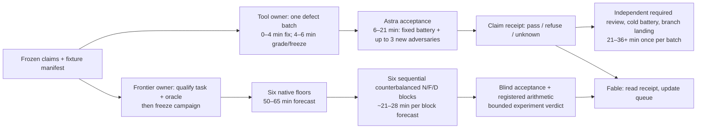

**The slowdown contains necessary hardening, but its size and repetition expose a defective routine. Freeze acceptance by claim, qualify the small measurement path, and let frontier discovery proceed alongside row-1 hardening. Do not relax truthfulness to recover cadence.**

<!-- agent-usage-window-end: 2026-09-08T06:40:37Z -->

Advice only. This document changes no apparatus, route, tree phase, or experiment authorization. The main accounting window is **2026-09-08 01:20:00–06:40:37 UTC**, 320.6 minutes (September 7, 18:20:00–23:40:37 PDT). Sources are the [captain’s log](/home/forge/src/clj-surgeon-records/docs/observations/2026-09-03-captains-log-anvil-seat.md:3589), [tree](/home/forge/src/clj-surgeon-records/docs/observations/2026-09-08-perfect-the-wins-tree.md), [round ledger](/var/tmp/forge/round/ledger.txt), [coldstart ledger](/var/tmp/forge/coldstart/ledger.txt), and the two completed [first](/var/tmp/forge/plan2/cellC/astra-B02-acceptance.md) and [second](/var/tmp/forge/plan2/cellC/astra-B02-acceptance-2.md) acceptance verdicts. Arithmetic over timestamped ledger rows is retained in [the counting extract](/var/tmp/forge/plan2/cellC/astra-cadence-ledger-summary.json).

Three corrections matter before diagnosing the story. The landed 8–9× observation occurred **inside** this window, at 03:18, not before 01:20. The window also bought source fixes, their landing, intent registration, delivery repairs, and the installed routing plate; it was not five hours of apparatus alone. Row 1 did not earn low, but “no progress” would erase substantial defect removal. Finally, there were only **two completed adverse acceptance verdicts** at the cutoff. A 06:41 log addendum reports that the third Astra attempt stopped at a provider filter rejection after a reported 94k tokens, with no report, and was reassigned to an Opus acceptor. An aborted review is neither a third rejection on the merits nor a pass. This advice does not prejudge its replacement.

**What the clocks establish.**

| Work / endpoint | Observed cost | What it means |
|---|---:|---|
| Round 3, immediately before the window | 8 inner iterations, 95 s machine time; reported 24 min elapsed | The measured inner loop occupied 6.6% of that elapsed interval. The remainder includes agent work and other gates; it is not all inference or idle CPU. |
| Round 4 accounting, logged 01:53 | Approximately 45 min wall for <3 min inner machine work | At least ~42 min was outside that inner loop. PID mistakes, repeated orientation, review and landing are named causes. The log’s component estimates overlap; they are not an additive stopwatch decomposition. |
| Round 5, first launch → receipt → landed batch | 02:06 → 02:22 → 03:14: approximately 16 min and 68 min | The famous **208 s** receipt begins at adoption. It contains ~150 s watched builder tail, ~47 s grade and ~9 s witnesses. Earlier work/repairs, review and landing are excluded. |
| Thirteen identified positive split/grade controls | Median **57 s**, range **55–60 s**, sum 750 s | Stable, useful machine execution. They are no-build controls, not thirteen accepted fixes. |
| All timestamped round records in the window | **51 records, 2,305 s = 38.4 min** summed runner wall | Includes synthetic negatives, repeats and partial third-review probes. Their median 33 s is dominated by early refusals and must not be advertised as round speed. |
| Pilot 1, p1–p4 | 565 s = 9.4 min summed runner wall | Four task results; incomplete workflow/delivery evidence. |
| Pilot-2 attempts p5–p8; final block p9–p12 | 554 s = 9.2 min; 648 s = 10.8 min | Both blocks cost money/time. Regrades are not additional caller runs. |
| Observed pilot 3, p13–p16 | **1,316 / 327 / 1,237 / 180 s; total 3,060 s = 51 min** | 4.72× the p9–p12 runner total, on a changed instrument. This is apparatus contamination, not a measured agent slowdown. |
| p13’s traced lifetime | Agent reportedly done at 213 s; launch released at 1,209 s | **996 s = 16.6 min** of specifically identified extra waiting in this one cell. Do not infer p15’s missing true-agent endpoint by symmetry. |
| All coldstart records in the window | 26 records, 5,046 s = 84.1 min summed runner wall | Sixteen pilot cells plus ten apparatus probes. This is not CPU time or elapsed critical-path time. |

The 38.4 and 84.1 minute sums overlap other activities and each other; subtracting them from 320.6 minutes would invent an “agent thinking” estimate. The ledgers do not provide a complete, overlap-safe attribution of this program’s engineering, inference, waiting and CPU consumption. They nevertheless identify two concrete opportunities: the p13 lifetime error and the 33-minute handoff interval below. Sixteen cores cannot accelerate a mistaken wait condition or a report waiting for relay.

The B02 cycle is especially revealing:

| Cycle | Log endpoints | Wall / limit |
|---|---|---|
| Initial B02 build | Building by 04:00, delivered 04:21 | At least 21 min; exact launch absent from this ledger. |
| Delivered B02 → acceptance launch | 04:21 → 04:54 | **33 min handoff interval**. Other work occurred; still a delay on this dependency path. |
| Acceptance 1 | Launch ~04:54 → report 05:08:03 | ~14 min; 182 s of round-ledger executions within it, plus unmetered here observer/session/other probes. |
| B02b and B02c | 05:09–05:39 and 05:18–05:45 | **30 and 27 min**, already overlapping by 21 min. Fable’s “entirely serial” diagnosis overstates it. |
| Acceptance 2 | Launch ~05:45 → report 06:00:36 | ~15.6 min; 256 s of round-ledger executions plus other probes. |
| B02d | 06:01 → 06:34 | **33 min**; third review launched immediately. |

Initial delivery → second verdict consumed ~100 minutes. The reviews themselves were already close to the proposed 15-minute budget. Merely shortening review prose will not remove the 30-minute rebuilds, initial 33-minute handoff, repeated fixture preparation, or invalid pilot. A four-minute target is sensible for one small fix on a ready image. It is not a defensible promise for a new observer plus runner plus historical-session verifier plus a cold battery: B03b’s recorded cold battery alone took **801 s**.

Tokens are less well measured than wall. Fable supplies **300–400k per apparatus build**: conditionally, four builds imply **1.2–1.6M reported tokens**, excluding completed reviews, pilots and Fable’s relay work; adding the later reported aborted 94k gives **1.294–1.694M**. Neither ledger contains per-build usage counters, input/output/cache splits, or billing attribution, so these remain attributed estimates, not an independently audited token total or dollar cost. The OTTER resume demonstrations—builder 6,948 fresh versus 1,170 resumed; reviewer 6,026 versus 6,072—are different demonstrations, not matched economic evidence. They establish memory, not savings. Future receipts must report cumulative input, cached input and output separately, plus wall, per accepted defect batch.

I also ran the standard usage collector once over the exact window: [receipt, status `ok`](/var/tmp/forge/plan2/cellC/astra-cadence-usage.json); its self-test passed. This is a host-wide sample, not a join identifying the four apparatus builds. It reports Codex **34 sessions / 26 Clojure-relevant / 25 task turns**, versus Claude **28 / 25 / no task-turn clock records**. Detected Surgeon operations are Codex **9** (five splits, two `:cat`, two `:ls`) and Claude **6** (splits). Codex’s eight timed Surgeon actions sum to **27.020 s**, while its 25 recorded task intervals sum to **280.1 min**, with 24 marked completed; **181.1 min (64.6%) of those intervals is unattributed**. These different denominators and mixed tasks cannot establish the program’s tool-wall share. Route aggregates contain native reads, patches, live probes and verification; they do not independently count this program’s fallbacks or recoveries. The collector has no token counters here. Default service roots report no MCP calls, but fixture-scoped servers are outside that scan; this is no evidence of zero fleet use. I use the requested ledgers for the cadence accounting, and retain unattributed time as unknown rather than relabel it inference.

**Where I disagree with Fable—and with my earlier plan.**

Acceptance was not absent: §3 already required terminal exit, complete proof, observer completeness and readiness. B02 explicitly declared terminal wait unbuilt, yet a pilot was launched. The second acceptance replayed old loss, truncation, missing-end and relative-client negatives that still passed. Those are incomplete repairs against a standing target. Empty-baseline and basename-command checks also repeated the same mistake: treating a field’s presence or spelling as authority.

But Fable is right that the executable contract was incomplete. Builder and reviewer maintained different corpora, and a passing corpus did not mean the published claim was covered. Some tests could be RED because an unrelated external oracle failed; the acceptance needed a committed positive fixture before proving the hostile receipt still produced GREEN. Freeze the **stimulus, expected axis, subject, supporting positive and production entrance**, not just “must reject bad receipts.” That would prevent a large part of this rebuild cycle.

My own §3 compounded the problem by bundling three products: trustworthy single runs, continuation economics, and a general observed workflow. They have different prerequisites. Making all of them one permission bit gave the slowest subproblem veto power over useful experiments. Likewise, my alternating hour plan and Fable’s “no row-5 work” interpretation encouraged serialization. The [tree’s explicit order](/home/forge/src/clj-surgeon-records/docs/observations/2026-09-08-perfect-the-wins-tree.md) does currently put row 5 after row 1 reaches low: parallel measurement is a **proposed scheduling amendment**, not permission that the old text secretly already granted.

Use three states per claim: **may collect**, **measurement valid**, **eligible for promotion**. Unqualified exploratory evidence is useful only when its missing dimensions are named. A label cannot rescue an unknown clock, wrong subject or broken output oracle.

**The smallest apparatus worth qualifying.**

One frozen run manifest, one owning supervisor, one evidence directory, one pure verdict function, and thin adapters to the existing gates. Do not commission another general runner. The manifest names the precise claim, allowed entrances, worktree/base/overlay, effective profile, executable hashes, readiness, required checks, clock endpoints and output retention. The supervisor reserves the bundle and canonical leases, launches its own fresh child, records real terminal status and final hashes, and freezes evidence. Certification of unsupported replay/adopt/resume paths is disabled. The verdict function consumes that bundle; it does not reconstruct authority from a success sentence.

| Standing obligation | Observed four-cell workflow pilot | Row-5 N/F/D measurement |
|---|---|---|
| Actual worker exit, bounded owned lifecycle, immutable bundle, source/profile identity, monotonic endpoints | **Required.** Worker exit 17, unknown termination or a ceiling cannot become a certified PASS. | **Required.** Include acquisition, queue, retries, fallback and equal final proof in the primary clock. |
| Exact completed proof, pending rejection, legitimate baseline comparisons, action/subject/result binding | **Required.** Final warm and cold successes must belong to this task’s actual final source. | **Required.** Prefer direct runner-owned oracle executions; never trust D’s receipt as the independent acceptance oracle. |
| Observer loss/truncation/end gates; exact JVM/gate ownership; quote/substitution parsing | **Required for “fully observed” and absence-of-forbidden-action claims.** Missing evidence caps the affected cell at UNVERIFIED. | The relevant execution/call/patch record is required to identify treatment, repair and fallback. The entire generic coldstart classifier is **not** required to compare accepted output and complete wall. Hidden execution that could change treatment identity remains disqualifying. |
| Filesystem/network/eval coverage | Required to the explicitly frozen F9/F10/F11 and workflow contract. Do not claim a repaired network observer proves arbitrary eval semantics. Retain gaps as gaps, not PASS footnotes. | No universal claim of “no hidden socket client” is needed. Keep subject/output snapshots, public-call evidence and complete native-action logs; unsupported behavioral dimensions are labelled unmeasured. |
| Delivered instructions, qualified declared gate, intended assertion-red, ready image, supplied client | **Required.** Freeze the current four cells: Opus/CC Ø and W; Sol/MVR Ø and W. Pre-existing failing assertion, body-only repair; actual Ø/W state attested. | Freeze identical task decisions, model/settings, environment and valid positive fixture. Mutation-test the acceptance oracle. The generic skill task’s red→warm workflow is not a requirement for a namespace-movement task. |
| Isolated effective instructions | Required for a clean delivery-condition comparison. A digest alone does not isolate. An observed execution pilot under fully enumerated fixed inherited instructions is a narrower possible claim, not silent satisfaction of the existing isolation gate. | Equal frozen effective profiles across N/F/D, with only declared treatment differences. Ambient instructions must not mandate Surgeon in N or leak D’s solution to F. |
| Resume history, previous terminal attestation, retained-image economics | **Not needed:** pilot callers are fresh. Use a separately qualified startup owner. | **Not needed:** all 24 measured callers are fresh. Useful builder persistence can continue without a speed claim; uncertified resume cannot authorize work through an unsafe path. |
| Adopt, sampler fallback, supplied-receipt certification | Disable these entrances for this narrow qualification; no need to build them. | Same. Existing diagnostic replay may remain machine-labelled diagnostic. |
| General 32-cell ×2 matrix, month of dogfood, every-seat deployment, automated landing, apparatus-share target | Later perfection/delivery claims; not prerequisites to collect the four-cell pilot. The pilot does not replace those gates. | Not prerequisites to collect a bounded comparison; no claim of shipping, low or perfection follows. |

Do not retroactively qualify p13–p16: their known truncated captures, original readiness and worker-status gaps cannot be repaired by changing a grader. Save their legitimate task results and use the traces as regression stimuli. Once the narrow observer/readiness package actually passes, rerun four fresh cells. Separately, row 1 still needs its actual split success/refusal/escape/kill evidence and **six fresh native floors plus two three-pair matched waves** at its registered ≥30% and >2SD threshold. Historical wave 5/6 timings do not become fresh matched controls because an earlier log called the rerun gate met.

Row 5 can use an even smaller measurement profile, but it cannot start a valid N/F/D campaign today merely by bypassing coldstart. First reconstruct and freeze the repaired Cell B fixture: `exports.clj`, 25 owners, retained source, eight retained dependencies, three authorized promotions, 43 external sites/nine files and the comment-cycle case. The 06:35 log records deletion of dirty Cell B output trees: stamps and reports survived; old output trees did not. Recover/recreate goldens from the pinned base, not from those lost trees. Repair A8’s case sensitivity, prove independent acceptance with planted mutants, qualify equal full `make runtests-once` proof, and hand-drive the new compiler/F projection. F must return facts without an emitter or candidate bytes. Those are load-bearing scientific prerequisites, not optional apparatus polish.

**An ideal concurrent flow, timed honestly.**

These are proposed service budgets, not observed capacity. Allocate **8 cores to one frontier arm**, **4 to tool development**, **2 to deterministic review**, **2 to supervision/headroom**. Keep JVMs, fixtures and output names separate. All lint uses `~/bin/clj-kondo`; its global serialization means affinity alone is insufficient isolation. Reserve analyzer slots, record wait time inside the task clock, and pause competing heavy gates during the frontier’s proof slot. Keep the background load policy identical across floor and comparison runs. Otherwise the parallel campaign is exploratory and the final paired claim needs controlled reruns. Do not run N/F/D simultaneously: the registered six arm orders are sequential.

| Tool lane, one ordinary defect batch | Actor and artifact |
|---|---|
| 0–1 min | Owner consumes an immutable finding ID with exact failing fixture and expected axis; obtain lease and pin candidate/battery. No new prose brief or rediscovery. |
| 1–4 min | Builder replays red, fixes, runs focused warm witnesses. A miss becomes a timed continuation of the same batch, not a fresh “four-minute” clock. |
| 4–6 min | Supervisor runs focused production integration and freezes candidate plus result. The ~57 s split/grade control supports this reservation; it does not guarantee every profile fits. |
| 6–21 min | Astra runs the frozen battery first; at most three additional adversaries target changed boundaries. Emit a short claim verdict and executable failures. Stop exploration at 15 minutes; a discovered false-certification bug still blocks its claim, and unfinished checks mean pending. |
| 21–36+ min | Independently required review, repository battery and authorized branch landing once per accepted batch. Reserve ~15 min initially given the 801 s cold battery; measure actual queue and overruns. No public-main landing. |

The next independent fixture/design work overlaps the last stage. A review never follows a moving build: freeze H, review H, develop H+1 separately, and bind the eventual landing decision to the final reviewed candidate. Existing LID review boundaries remain real; an agent cannot automate Gene’s required design decision. Report both the 4–6 minute development receipt and **request-to-accepted/landed wall**. If there are several defects in a batch, disclose allocation rather than assigning the entire suite zero cost to each.

The frontier lane has a different clock. While tool hardening runs, spend the first **20–30 minutes** freezing the task, repaired oracle mutants and minimal runner proof. If the compiler’s partial-retention path is absent, use the existing **four cumulative engineering-hour feasibility cap**, with a decision every 30 minutes; do not pretend implementation is a measurement launch. No timed slot begins until readiness and independent acceptance are proven.

Once ready, one N/F/D block reserves roughly **2 min admission/setup outside the primary clock**, **N 8.3–10.8 min**, **F 7.2–9.2 min**, **D 5.5–7.3 min**, then **2 min to seal results and queue blind review**. Arm order rotates through all six permutations; per-arm orient-start→all frozen acceptance remains the primary endpoint. Required review/proof completion cannot be omitted merely because the result table is written later. These forecasts come from the [existing preregistration](/var/tmp/forge/plan2/cellC/astra-plan-tree.md:79), not new measurements. Six floor runs followed by six blocks still take roughly **3.1–4.1 serial timed hours plus preparation/review**; 16 cores do not turn the registered experiment into a 15-minute task.

Keep the primary gate unchanged: 24 attempts (six floor N, then six N/F/D blocks); all six D accepted, no regression; ≥5/6 without interface repair/native fallback; median paired D/N≤0.75; median saving≥90 s and >2 sample SD of native floor. Report 30% saving and 6/6 no-fallback as secondary. Retain timeouts at the registered 1,800 s cap, failed controls and unknown results; a missing valid denominator blocks a win. F/N and D/F remain the mechanism comparisons. Do not pool preliminary runs or change thresholds after seeing them.

**What Fable should stop doing.**

- Stop being the report transport. The builder publishes candidate hash, claim IDs, fixture diff, machine receipt and missing checks directly to records. The reviewer reads that frozen package and publishes there. Fable consumes a ≤12-line receipt plus links, and opens details only for a decision or contradiction. Reports can retain forensic detail without being copied into every next prompt.
- Stop launching acceptance cohorts against explicitly unbuilt acceptance prerequisites. One live readiness canary is cheaper than another four-cell failed measurement. Run all saved negatives before buying a new caller.
- Stop treating every refusal as a request to expand the platform. Disable unnecessary adopt/replay/sampler paths; keep resume economics separate. One false-green class gets one fix batch, not a new omnibus apparatus brief.
- Stop turning the phase ladder into a ban on learning elsewhere. Preserve row 1 as the hardening priority; reserve a frontier lane for a bounded experiment under its own evidence contract.
- Stop counting reports, tokens, 11-second iterations or 57-second grades as completed progress. Count accepted claim deltas, valid experiment blocks and measured request-to-closure wall. Token budgets should trigger decomposition, not forced green verdicts.
- Stop editing an executing runner, hunting for guessed PIDs, and deleting dirty outputs to reclaim space. Freeze executable dependencies before launch; let one supervisor own children; retain diff **and** final output archive plus hashes before reclaiming a specimen. Disk pressure is now a measured scheduling constraint.
- Stop claiming a general catastrophe or a magnificent phase advance from partial receipts. The fixed plate and corrected source are real wins; the pilot remains unqualified; row 5 remains unknown. All three can be true at once.

**The battery I would freeze now.**

This is the proposed named manifest, **not a claim that I implemented or ran a new battery in this advice task**. Copy the actual fixture bytes, exact argv, expected field values/reason, positive baseline, production runner/grader dependencies and hashes into one versioned records package. Pure rows run quickly; a small separate integration layer proves wiring and lifecycle. Synthetic replay can validate a parser but never count as a fresh caller. A negative must fail on its intended axis with unrelated checks green. A positive must pass, so reject-everything cannot qualify.

Freeze all **20 current round-schema rows** from [round-fixtures.py](/var/tmp/forge/round/fixtures/round-fixtures.py:108):

| Family | Exact fixture row names |
|---|---|
| Positive / baseline authority | `positive-real-receipt`; `empty-baseline-map`; `nil-baseline`; `baseline-with-no-comparison`; `forged-delta-arithmetic`; `disagreeing-baselines` |
| Subject / commands / replay | `unrelated-subject-argv`; `basename-only-program`; `foreign-fixture-same-basename`; `supplied-receipt-clean-schema`; `supplied-receipt-bad-schema` |
| Proof completeness / status | `verification-incomplete`; `failed-status-exit17`; `missing-fixed-check`; `missing-profile-command`; `status-outside-vocabulary`; `baseline-excuse-on-non-analysis`; `non-empty-blockers`; `unparseable-receipt`; `split-call-exit-17` |

Freeze the existing coldstart corpus by the **(transcript, trace, condition, options)** tuple, not transcript filename alone. [run-fixtures.sh](/var/tmp/forge/coldstart/fixtures/run-fixtures.sh) contains 39 grade invocations, the cwd parser assertion and the separate live helper:

| Family | Exact fixture names / distinguishing variants |
|---|---|
| Seven positives | `pos-claude.jsonl`; `pos-claude-W.jsonl`; `quoted-pkill.jsonl`; `pos-receipt-cond0.jsonl`; `pos-codex.log`; `pos-codex-exited.log`; `pos-codex-quoted.log` |
| Three transcript negatives | `neg-claude.jsonl`; `neg-tmp-receipt.jsonl`; `neg-codex.log` |
| Hidden execution / missing capture | `demo-transcript.log` + `demo.trace`; `demo2-transcript.log` + `demo2.trace`; `pos-codex.log` + no trace → UNVERIFIED |
| Real pilot regressions | `cx15-p13-transcript.jsonl` + `cx15-p13-start.trace`; `cx16-cx17-p16-transcript.log` + `cx17-p16-gate.trace`; `cx16b-stray-quote-p12.log`. First two remain UNVERIFIED for truncation while their positive semantic subchecks remain asserted. |
| Gate ownership controls | `pos-codex.log` with each of `cx17-p16-gate.trace`, `astra7-inert-gate.trace`, `astra7-gate-once.trace`, `astra7-unrelated-jvm.trace`, `astra7-duplicate-gate.trace`; preserve exact specimen/condition options. |
| Filesystem and terminal proof | `astra8-tmp-write.trace`; `astra8-write-unlink.trace`; `astra9-cold-exit17.log`; `astra9-pending-receipt.log` |
| Readiness decision | `astra10-red-first.log` with declared red; `astra10-no-red.log` with declared red; `astra10-no-red.log` without red. The last is a **parser capability** positive only; add runner admission below so it cannot certify the pilot. |
| Capture gaps | `b02d-relative-client.trace`; `b02d-truncated.trace`; `b02d-missing-end.trace`; `b02d-lossy.sampler` with loss 99 → UNVERIFIED |
| Ownership and proof joins | `b02d-two-jvms-one-start.trace`; `b02d-foreign-basename-gate.trace`; `b02d-cold-exit17.log` + `b02d-observed-zero-masks-transcript17.trace`; `b02d-second-gate-unknown-exit.trace`; `b02d-failed-final-warm.log` |
| Quoting / cwd | `b02d-quoted-kill.jsonl`; `b02d-quoted-substitution.log`; parser row `b02d-parent-cwd-at-fork` using `b02d-parent-cwd-after-fork.trace` |
| Live lifecycle | `cx14-launch-ends.sh`: successful worker with long-lived child; preserve actual worker endpoint separately from runner total. |

Unify the existing acceptance programs into these **named boundary rows**; names below are proposed stable IDs, derived from already witnessed failures, not newly executed tests:

| Proposed row IDs | Required result / claim |
|---|---|
| `BOUNDARY-real-split-positive`, `BOUNDARY-terminal17-all-other-checks-green`, `BOUNDARY-instant-exit`, `BOUNDARY-orphan-unknown` | Real production split passes; failed/unknown builder never certifies. |
| `BOUNDARY-normal-collision`, `BOUNDARY-fixture-held-no-reset`, `BOUNDARY-adopt-disabled` | One ownership domain; refusal preserves protected fixture bytes. |
| `BOUNDARY-duplicate-bundle-race`, `BOUNDARY-midflight-frozen-dependencies`, `BOUNDARY-untracked-config-drift` | Complete output bundle stays intact; executing version immutable; changed effective subject cannot borrow proof. |
| `PILOT-worker17-logger0`, `PILOT-long-child-worker0` | Actual worker result governs; logger and tracer cannot manufacture success or timeout. |
| `PILOT-delivery-byte-tamper`, `PILOT-gate-missing-or-fails`, `PILOT-red-missing-or-wrong-assertion`, `PILOT-ready-red-warm-green-cold-green` | Three prelaunch refusals plus one genuine readiness positive on each of CC and MVR. |
| `PILOT-fresh-hidden-jvm`, `PILOT-fresh-relative-client`, `PILOT-benign-deleted-script`, `PILOT-complete-clean-capture` | Re-capture with frozen production flags. Catch contracted hidden behavior; do not classify every benign deletion as a client; qualify a positive capture too. |
| `PILOT-profile-drift`, `PILOT-final-source-after-proof`, `PILOT-same-action-result-conflict` | Changed profile/source or contradictory terminal evidence cannot certify. |

Keep the already executed OTTER, wrong-root, mismatched-settings and config-restoration fixtures in a **separate continuation suite**. A continuation gap blocks its own certification/economic claim; it does not veto the fresh-caller pilot or N/F/D. Preserve any subsequently delivered third-review counterexample that defeats one of these frozen claims as a regression, with a version increment and impact ruling. A new unrelated claim goes to the backlog. Fifteen minutes bounds exploration; it never overrules a known invalidating result.

For row 5, freeze a small **separate task battery** before timing. Proposed names: `ROW5-golden-native`; `ROW5-golden-compiler`; `ROW5-A8-case-sensitive-lint-mutant`; `ROW5-moved-to-retained-unqualified`; `ROW5-retained-caller-wrongly-redirected`; `ROW5-comment-cycle`; `ROW5-three-promotions-exact`; `ROW5-moved-visibility-preserved`; `ROW5-protected-bytes-and-mixed-callers`; `ROW5-facts-no-emitter`; `ROW5-stale-facts-refusal`; `ROW5-equal-full-proof`; `ROW5-terminal-timeout-retention`; `ROW5-fallback-and-repair-observed`. Each gets actual fixture bytes, a known-good control and an independently checked expected verdict. These supplement the shared identity/exit/bundle spine; they do not inherit the generic coldstart workflow’s unrelated gates.

**Decision on parallel row-5 measurement: YES, as a proposed amendment to the schedule.** Begin oracle/fixture/feasibility work alongside row-1 hardening. Permit timed exploratory work once its own subject, clock, treatment and output gates pass; mark it experimental and do not promote row 5 or change routing. Run the registered 24-attempt campaign only on a frozen qualified measurement profile, with controlled resource conditions. Continuation economics and universal workflow certification are not its prerequisites; acceptance integrity is.

The split improved; the loop lost time to handoffs, repeated false greens and a broken observer wait.
Freeze acceptance by claim; keep reviews to 15 minutes and run row-5 discovery beside row-1 hardening.
Require trustworthy proof and clocks now; let broader qualification and dogfood follow on their own schedule.
